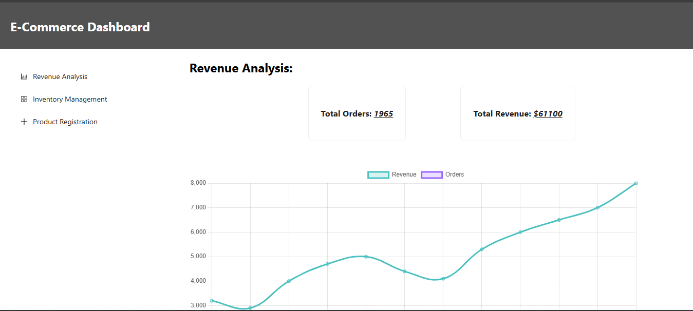
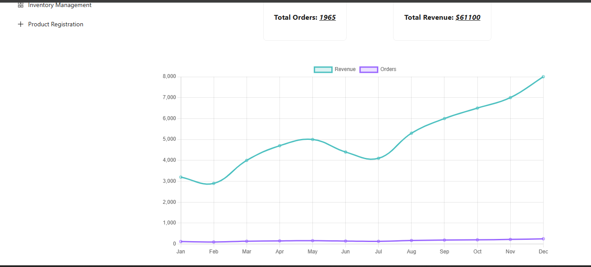
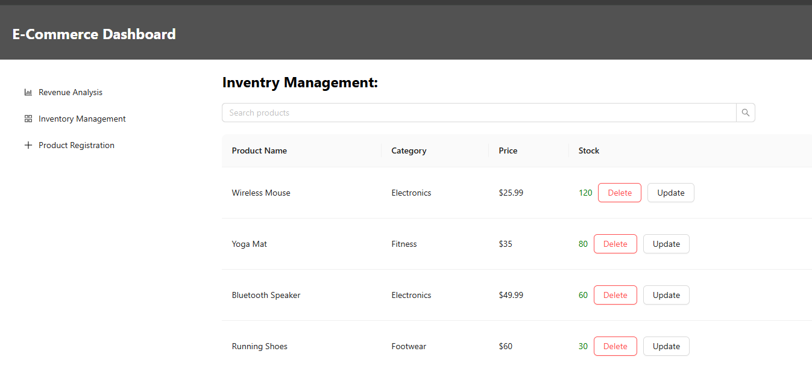
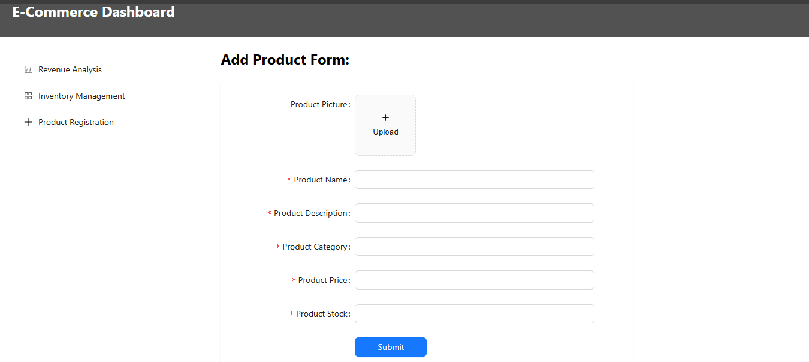

# E-commerce Admin Dashboard

A front-end project for managing an e-commerce platform's sales, inventory, and products — built using **React** and **Ant Design**.

## Features

- Revenue Analysis with charts (orders & revenue)
- Inventory Management with stock status & alerts
- Product Registration form with image upload
- Search and filter capabilities
- Responsive layout using Ant Design

## Tech Stack

- React JS
- Ant Design
- Chart.js (`react-chartjs-2`)
- React Router

## Live Demo

[🔗 Click Here to View Hosted App](https://muhammadsiddiqui07.github.io/E-Commerce-Dashboard/)

## Screenshots

## Revenue Analysis



## Inventory


## Product Form


## Run Locally

```bash
git clone https://github.com/Muhammadsiddiqui07/E-Commerce-Dashboard.git
cd ecommerce-admin-dashboard
npm install
npm run dev
